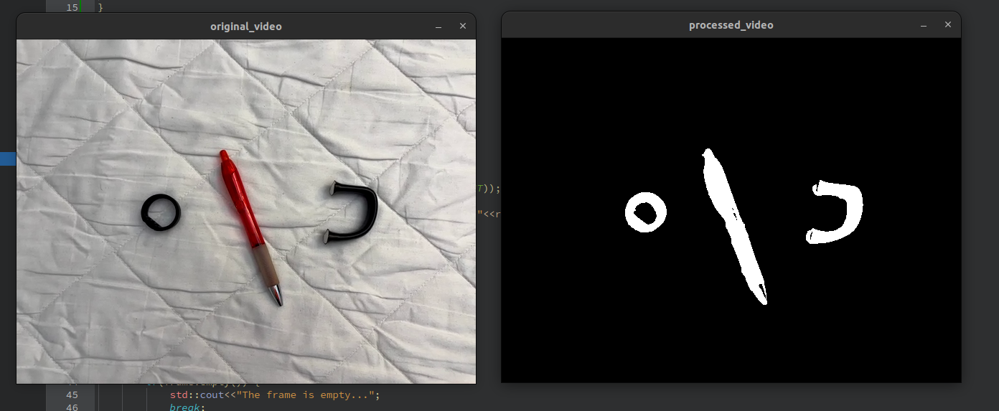
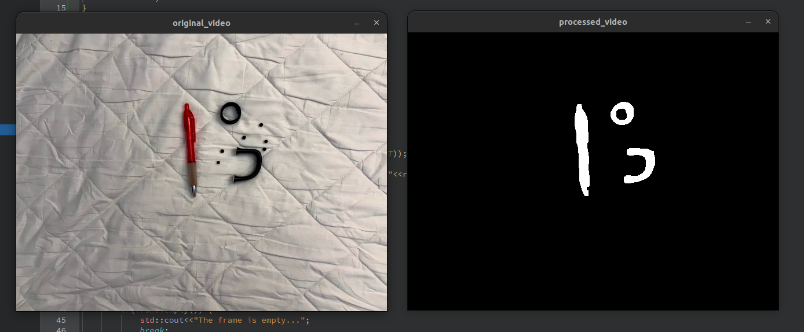
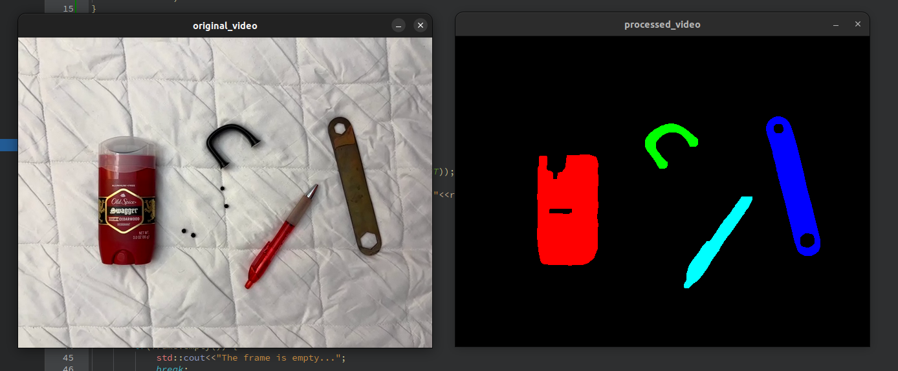
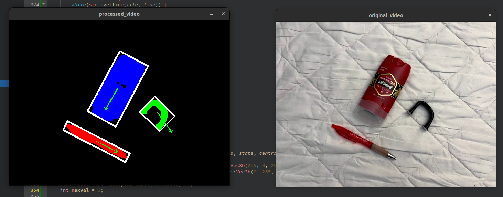
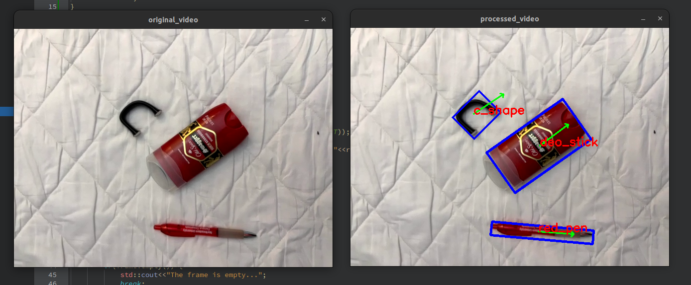

# Real-time 2D Object Recognition (only using C++ and OpenCV)

## Table of Contents

1. [Introduction](#Introduction)
2. [Installation](#Installation)
3. [Results](#Results)

## Introduction
The project speaks all about “Real Time 2-D Object Detection”. Our aim is to have the computer identify 
a set of objects with the background as a plan white surface. The set of objects when look down 
through a camera in the defined background should not vary when the camera is translated, zoomed 
in/out, or rotated on these objects. It should also be compatible when tested with a given video.
This project also requires setting an environment/workspace depending on the types of camera 
devices, lighting conditions and set of objects indulged in this project. Thus, setting up perfect 
workspace conditions does play an important role in this project. 
To get this project up and running, tasks are defined. These tasks serve as essential guidelines, 
displaying the expected functionalities of each stage. Additionally, they act as checkpoints to validate 
whether the outputs align with the desired requirements for each task.

for more info [user manual](report.pdf) and https://drive.google.com/file/d/15g6uBcigfUhCiSU8xwIDQws_zaKUkxFT/view

### Development Environment
- **Operating System:** Ubuntu 22.04
- **IDE:**  Qt creator


## Installation
### 1. Cloning the project
```
   git clone https://github.com/ARUNSRINIVASAN12/Real-time-2D-Object-Recognition.git
   cd /project location
```

### 2. Install C++ Compiler
   
  You need a C++ compiler installed on your system to build and run this project. If you don't have one installed, follow the instructions below:

  * **Windows:** Install MinGW or Visual Studio with C++ development tools.
  * **Mac:** Install Xcode command-line tools or GCC through Homebrew.
  * **Linux:** Install GCC through your package manager (e.g., `sudo apt install g++` on Ubuntu).
  
### 3. Setup Visual Studio Code \
Visual Studio Code is a lightweight but powerful source code editor that runs on your desktop. To set up Visual Studio Code for C++ development:

1. Download and install Visual Studio Code.
2. Install the C/C++ extension by Microsoft from the Extensions view (`Ctrl+Shift+X`).
3. Open your project folder in Visual Studio Code.

### 4. OpenCV Installation (Pre-configured OpenCV for Python and C++ from GitHub releases)
1. Download opencv-4.5.1-vc14_vc15.exe from the latest release: https://github.com/opencv/opencv/releases/tag/4.5.1
2. unpack to C:\opencv
3. edit environment variables. Win search "Environment variables"
4. append to Path the path to OpenCV: C:\opencv\bin
5. restart computer
6. open cmd
7. `echo %Path%` output should contain a new path


## Results


<p align="center"><em> Fig 1. Thresholded i/p image after using morphological operations. </em></p>



<p align="center"><em> Fig 2. Eliminating noise in the frame. </em></p>



<p align="center"><em> Fig 3. Multiple segmented objects. </em></p>



<p align="center"><em> Fig 4. Multiple objects in a frame with oriented bounding box and axis of least central moment. </em></p>



<p align="center"><em> Fig 5. Real-time 2D Object Recognition (resulted in >40 fps) . </em></p>
